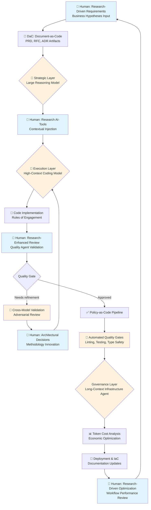

# RAISE: A Research-Driven, AI-First Software Engineering Framework for High-Compliance Environments

A framework for integrating high-performance AI agents into regulated software environments.

**Version:** 0.1  
**Release Date:** 2025-07-07  
**DOI:** [10.5281/zenodo.18519189](https://doi.org/10.5281/zenodo.18519189)

## Abstract

As Large Language Models (LLMs) increasingly automate code generation, the primary constraint in software engineering is shifting from implementation velocity to contextual accuracy and regulatory compliance. Traditional Agile methodologies, designed for human-centric coding, often fail to leverage the full capacity of AI agents or manage their stochastic risks.

**RAISE (Research-Driven AI-First Software Engineering)** is a novel workflow framework designed for hyper-growth, high-compliance environments. RAISE decouples execution from governance, assigning code synthesis to specialized AI agents while shifting human effort toward "high-value research"—defining problems, validating architecture, and managing economic efficiency.

## Core Principles

The RAISE framework is built upon two foundational principles:

1. **AI-First Execution:** LLMs are treated not as assistants, but as primary agents of implementation.
2. **Research-Driven Oversight:** Human engineering time is reallocated from syntax generation to _research_—investigating emerging tools, defining architectural boundaries, and optimizing cost models.

## Theoretical Foundation

The framework operates on the premise that LLMs and Small Language Models (SLMs) will continuously improve at routine engineering tasks. Consequently, human intervention must move "up the stack" to areas where AI lacks training data or context.

### The Research-Driven Human Contribution

Current LLMs suffer from "knowledge cutoffs"—they are unaware of the latest frameworks, security vulnerabilities, or internal company constraints released after their training date. In the RAISE model, the human engineer's role is defined as:

- **Methodology Innovation:** Discovering new architectural patterns that AI models have not yet ingested.
- **Contextual Injection:** Providing the AI with "fresh" research regarding industry standards (e.g., new ISO regulations) or project-specific constraints.
- **Economic Optimization:** Managing the "token economics" of the development lifecycle.

### The AI-First "Agentic" Shift

Unlike "AI-Assisted" workflows (where a human writes code and AI suggests completions), RAISE is "AI-First." The AI generates the initial implementation, documentation, and tests based on human-defined specifications. The human acts as a _Reviewer_ and _Architect_ rather than a _Writer_.

## The RAISE Framework Architecture

The framework operates on a **Heterogeneous Model Orchestration** architecture, leveraging a workflow that assigns distinct cognitive roles to specific model classes based on their capabilities (e.g., reasoning depth vs. context window size).

### The Workflow

The Software Development Lifecycle (SDLC) is divided into three distinct phases, each mediated by a specialized AI agent:

#### 1. Strategic Layer (Ideation & Logic)

- **Objective:** Define "what" to build without detailing "how."
- **Agent Role:** _The Strategist_ (Implementation: **Large Reasoning Model**)
- **Process:** The human engineer inputs raw business hypotheses. The agent refines these into **Document-as-Code (DaC)** artifacts—specifically Product Requirement Documents (PRD) and Requests for Comments (RFC). This ensures that ambiguity is resolved _before_ implementation begins.

#### 2. Execution Layer (Implementation)

- **Objective:** Convert DaC artifacts into functional, compliant code.
- **Agent Role:** _The Builder_ (Implementation: **High-Context Coding Model**)
- **Configuration:** The agent operates under strict "Rules of Engagement" defined in a semantic governance repository. These rules mandate adherence to internal style guides and coding best practices.

#### 3. Governance & Infrastructure Layer

- **Objective:** Deployment, documentation, and cost management.
- **Agent Role:** _The Librarian_ (Implementation: **Long-Context Infrastructure Agent**)
- **Process:** This agent manages Infrastructure-as-Code (IaC), updates internal wikis, and analyzes token usage logs to recommend cost-saving optimizations.

### Workflow Diagram



**Legend:**

- 👤 **Blue nodes:** Research-driven human critical decision points
- 🤖 **Orange nodes:** AI agent-driven tasks with human oversight
- 🔄 **Process nodes:** Iterative cycles with continuous feedback

## The Governance Gate (Policy-as-Code)

To safely deploy AI-generated code in a regulated environment, RAISE imposes a "Zero-Trust" verification pipeline:

### Cross-Model Validation

Code written by the _Builder Agent_ is reviewed by a separate _Quality Agent_. This adversarial review process catches logic errors that a single model might miss.

### Automated Quality Gates

A pre-commit pipeline enforces deterministic checks:

1. **Linting:** Automated formatting enforcement
2. **Testing:** Mandatory code coverage thresholds for all branches and functions
3. **Type Safety:** Strict static compilation checks

## Implementation and Configuration

### Deterministic Agent Configuration

To prevent the "drift" often associated with LLM code generation, the framework utilizes context-aware instruction sets:

- **Context-Aware Governance Rules:** Defines the "Constitution" for the AI agent. It explicitly forbids the agent from modifying code without first analyzing the existing architectural patterns.
- **Chain-of-Thought Audit Logs:** A logging pattern where the agent must document its reasoning in a dedicated artifact (`.ai-diary/`). This provides a traceable audit trail for compliance officers, explaining _why_ a specific algorithmic decision was made.

### The Testing Architecture

RAISE mandates a Test-Driven Development (TDD) cycle where the AI generates tests _before_ or _alongside_ functionality:

- **Unit & Integration:** The pipeline is configured to block any commit that lowers the global coverage threshold below acceptable standards (80%).
- **End-to-End (E2E):** Tests are generated to validate critical user flows, ensuring that AI-generated UI changes do not break business logic.

### Economic Monitoring

The framework introduces **Token Cost Analysis** as a standard engineering metric:

- **Pre-Task Estimation:** Engineers are trained to estimate token load before complex queries.
- **Model Routing:** Routine tasks (documentation formatting) are routed to lower-cost models, while complex architectural reasoning is routed to specialized "Reasoning Models," optimizing the return on compute spend.

## Reference Implementation

This repository demonstrates RAISE principles using a modern web technology stack. The principles remain agnostic to the underlying technology.

### Technology Stack

- **Framework:** Next.js with TypeScript
- **Styling:** Tailwind CSS
- **Testing:** Jest (Unit/Integration) + Cypress (E2E)
- **Quality Gates:** ESLint, Prettier, Husky pre-commit hooks

### Coverage Standards

```javascript
coverageThreshold: {
  global: {
    branches: 80,
    functions: 80,
    lines: 80,
    statements: 80,
  },
}
```

### Pre-Commit Quality Pipeline

```json
{
  "*.{js,jsx,ts,tsx}": [
    "prettier --write",
    "eslint --fix",
    "jest --bail --findRelatedTests"
  ],
  "*.{json,md,yml,yaml}": ["prettier --write"]
}
```

## Getting Started

### Using Docker (Recommended for Reviewers)

```bash
docker build -t raise .
docker run -p 3000:3000 raise
```

Open [http://localhost:3000](http://localhost:3000) to view the application.

### Development Server

```bash
npm install
npm run dev
```

Open [http://localhost:3000](http://localhost:3000) to view the reference implementation.

### Verification Commands

```bash
# Type checking
npx tsc --noEmit --project tsconfig.test.json

# Test execution
npm test
npm run test:coverage

# Code quality
npm run lint
npm run format:check

# E2E testing
npm run test:e2e
```

## Project Structure

```
raise/
├── .ai-diary/           # Chain-of-Thought audit logs
├── .cursor/rules/       # Context-aware governance rules
├── .github/             # Quality agent configuration
├── src/
│   ├── __tests__/       # Unit and integration tests
│   ├── app/             # Next.js application
│   ├── components/      # UI components
│   ├── lib/             # Business logic
│   └── types/           # TypeScript definitions
├── cypress/             # E2E test suite
├── tex/                 # Academic paper source
└── public/              # Static assets
```

## Discussion and Impact

### Preliminary Results

In early-stage deployments of the RAISE framework within global-scale regulated environments, significant acceleration in software delivery metrics was observed. By moving the "Code Review" phase to an asynchronous, AI-first model, deployment cycle times for complex features were reduced substantially—suggesting that the primary friction in traditional regulated software engineering is not implementation difficulty, but the latency introduced by synchronous human coordination.

### The Shift in Developer Roles

Implementing RAISE transitions the engineering workforce from "Code Producers" to "System Architects":

- **The Junior Engineer:** Focuses on reviewing AI output and learning through "reverse engineering" the AI's solutions.
- **The Senior Engineer:** Focuses on "Prompt Engineering Strategy" and defining the regulatory boundaries within which the AI must operate.

### Compliance in Regulated Environments

In financial and healthcare sectors, the "Black Box" nature of AI is a liability. RAISE mitigates this through the **Document-as-Code** pillar. By forcing the AI to generate human-readable PRDs and ADRs _before_ coding, the framework creates a paper trail that satisfies audit requirements.

## Future Work

Future development will focus on automating the "Context Injection" layer, allowing agents to autonomously "research" internal documentation without human prompting.

## References

1. G. Amazonas, "RAISE: A Research-Driven, AI-First Software Engineering Framework for High-Compliance Environments," Zenodo, 2026. Available: https://doi.org/10.5281/zenodo.18519189
2. A. Vaswani et al., "Attention Is All You Need," in _Advances in Neural Information Processing Systems_, vol. 30, 2017. Available: https://arxiv.org/abs/1706.03762
3. S. Maatouk et al., "Large Language Models (LLMs): Deployment, Tokenomics and Sustainability," Huawei, University of Ottawa, 2024. Available: https://arxiv.org/abs/2405.17147
4. OpenAI et al., "Early science acceleration experiments with GPT-5," OpenAI, Harvard University, University of Cambridge, 2025. Available: https://arxiv.org/abs/2511.16072
5. Z. Ziegler et al., "Research: Quantifying GitHub Copilot's impact on developer productivity and happiness," _GitHub Research_, 2024.
6. P. Ralph et al., "Generative AI and Empirical Software Engineering: A Paradigm Shift," _arXiv preprint arXiv:2502.08108_, 2025.
7. "10 Benefits and 10 Challenges of Applying Large Language Models to Software Acquisition," _Software Engineering Institute (SEI) Blog_, Carnegie Mellon University, 2024.
8. "An Empirical Study on Challenges for LLM Application Developers," _arXiv preprint arXiv:2408.05002_, 2024.

## License

MIT License

## Citation

If you use RAISE in your research, please cite:

```bibtex
@misc{amazonas2025raise,
  author = {Amazonas, Gabriel},
  title = {RAISE: A Research-Driven, AI-First Software Engineering Framework for High-Compliance Environments},
  year = {2025},
  publisher = {GitHub},
  url = {https://github.com/GabrielAmazonas/raise}
}
```
