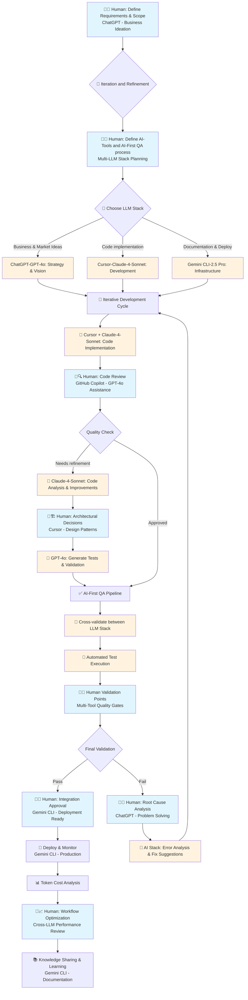

# RAISE - Research-Driven AI-First Software Engineering

### Version: 0.1

### Release Date: 07/07/2025

**Every Software Engineer deserves a RAISE.**

RAISE is a project dedicated to **supporting the Software Engineering community with research-driven approaches to AI-first software engineering**. This portfolio showcases how cutting-edge AI models and tools can be integrated into modern software development workflows while maintaining high standards of code quality and engineering best practices.

## Core Principle & Rationale

The fundamental principle behind RAISE is that **LLMs and specialized SLMs will continuously improve at software engineering tasks over time**.

As engineers, failing to integrate these tools into our daily engineering workflows represents a **massive opportunity cost** that will only grow larger with each passing day.

As the cost of producing functional code approaches zero, RAISE proposes that **human effort should be strategically focused on**:

- **Defining project priorities** and addressing problems with crystal clarity—including objectives, expectations, non-goals, and success criteria
- **Enabling Quality Assurance** for AI-First engineering projects through systematic validation processes
- **Implementing fully automated cost monitoring and control strategies** for:
  - LLM token usage and API costs
  - Computational resource allocation and optimization
- **Enabling automated performance monitoring** connected to a continuous efficiency improvement iteration loop

## Project Vision

RAISE bridges the gap between academic research and practical software engineering by:

- **Research Foundation**: Incorporating insights from foundational papers like "Attention Is All You Need" and recent research on LLM deployment and sustainability
- **Community Wisdom**: Drawing inspiration from industry leaders like Uncle Bob Martin (Clean Code, TDD) and Kent Beck (Extreme Programming, AI-assisted development)
- **AI-First Approach**: Leveraging multiple LLM models and AI tools to enhance productivity while maintaining developer creativity and code quality

## Tech Stack

### LLM Models

- **OpenAI GPT-4o** - Strategic ideation, business refinement, and cross-team communication
- **Anthropic Claude-4-Sonnet** - Precision code generation, refactoring, and development workflows
- **Google Gemini 2.5 Pro** - Quality assurance architecture, deployment orchestration, and infrastructure optimization

### Development Tools

- **Cursor** - AI-powered code editor
- **ChatGPT** - Interactive development assistance and strategic ideation
- **GitHub** - Version control and collaboration
  - **GitHub Copilot** - Real-time code review and quality assurance
- **Gemini CLI** - Command-line AI integration and deployment automation

### Framework & Technologies

This is a [Next.js](https://nextjs.org) project built with modern web technologies, featuring:

- TypeScript for type safety
- Tailwind CSS for styling
- Jest and Cypress for testing
- Research-driven component architecture

## How Each LLM Was Used

- **GPT-4o (via ChatGPT)**: Employed for high-level marketing and business ideation, helping to define the project's vision and strategic direction.
- **Claude 4 Sonnet (via Cursor)**: Utilized as the primary coding assistant within the Cursor IDE, focusing on writing, refactoring, and debugging application code.
- **GPT-4o (via GitHub Copilot)**: Integrated for real-time code review, quality assurance, and maintaining coding standards throughout the development process.
- **Gemini 2.5 Pro (via Gemini CLI)**: Leveraged for architectural planning, infrastructure setup, and deployment strategies, ensuring a robust and scalable foundation.

## RAISE Workflow: Multi-LLM Development Process

### Engineering Workflow Diagram



**Legend:**

- 👤 **Blue nodes**: Human-critical decision points with AI tool assistance
- 🤖 **Orange nodes**: AI-driven tasks with human oversight
- 🔄 **Process nodes**: Iterative cycles with continuous feedback
- 💬🔧🔍🏗️✅🚀🔬📈 **AI Tool Icons**: Specific AI assistants used in each human task

### 1. **Iteration and Refinement** 🎯

**Human Role**: Critical - Define requirements, scope, and success criteria with AI assistance

- Define AI-Tools and AI-First QA process for systematic development
- Choose appropriate LLM stack based on task complexity:
  - **ChatGPT-GPT-4o**: Business strategy, market ideas, problem solving
  - **Cursor-Claude-4-Sonnet**: Code implementation, refactoring, design patterns
  - **Gemini CLI-2.5 Pro**: Documentation, deployment, infrastructure
  - **GitHub Copilot-GPT-4o**: Code reviews, quality assurance

### 2. **Iterative Development Cycle** 🔄

**AI-First Implementation with Tool Stack**:

1. **Strategy & Planning**: ChatGPT-GPT-4o for business logic and market-driven decisions
2. **Code Implementation**: Cursor + Claude-4-Sonnet for development and refactoring
3. **Code Review**: GitHub Copilot-GPT-4o for quality assurance and best practices
4. **Testing & Validation**: Multi-LLM approach for comprehensive test generation
5. **Documentation & Deployment**: Gemini CLI-2.5 Pro for docs and infrastructure

**Human Oversight with AI Assistance**:

- Code review at each iteration with GitHub Copilot support
- Architectural decisions guided by Cursor's design pattern suggestions
- Integration testing validation with multi-tool quality gates
- Performance monitoring and workflow optimization

### 3. **AI-First QA Pipeline** ✅

**Automated AI Stack Validation**:

- Cross-validate implementations between ChatGPT, Claude, and Gemini
- Multi-tool quality gates with GitHub Copilot code review integration
- Automated test generation and execution across the LLM stack
- Code quality metrics monitoring with tool-specific insights

**Human Validation Points with AI Tool Support**:

- Functional requirements verification with ChatGPT business logic validation
- User experience evaluation with Cursor design pattern assistance
- Security and compliance review with GitHub Copilot security insights
- Final integration approval with Gemini CLI deployment readiness checks

### 4. **Token Cost Management** 💰

#### **Cost Monitoring Strategies**

- **Pre-task Estimation**: Calculate token requirements before starting
- **Model Selection**: Use cost-effective models for appropriate tasks:
  - Simple tasks: ChatGPT-3.5 or Gemini Flash
  - Complex tasks: Reserve GPT-4o/Claude-4 for critical decisions
- **Batch Processing**: Group similar requests to minimize API calls

#### **Cost Control Techniques**

- **Context Optimization**: Maintain focused, relevant context windows
- **Response Caching**: Store and reuse common code patterns
- **Progressive Refinement**: Start with cheaper models, escalate as needed
- **Token Budgets**: Set daily/weekly limits per project phase

#### **Monitoring Tools**

- Real-time token usage tracking via API metrics
- Cost per feature/component analysis
- ROI measurement: Development time saved vs. token costs
- Monthly budget alerts and optimization recommendations

## Human-in-the-Loop Critical Points 🤝

### **Strategic Decision Making** 💬

- Architecture and design patterns selection with Cursor assistance
- Technology stack choices guided by multi-LLM insights
- Feature prioritization and scope definition with ChatGPT market analysis

### **Quality Control Gates** 🔍

- Code review for maintainability and standards compliance with GitHub Copilot
- Integration testing and system validation across the AI tool stack
- Performance benchmarking and optimization decisions with cross-LLM feedback

### **Domain Expertise** 🏗️

- Business logic validation enhanced by ChatGPT strategy insights
- User experience design decisions supported by Cursor design patterns
- Security and compliance requirements verified through GitHub Copilot analysis

### **Continuous Learning** 📈

- Model performance evaluation and LLM stack selection optimization
- Workflow optimization based on multi-tool performance results
- Team knowledge sharing and best practices evolution with Gemini CLI documentation

## Getting Started

First, run the development server:

```bash
npm run dev
```

Open [http://localhost:3000](http://localhost:3000) with your browser to see the result.

You can start editing the page by modifying `app/page.tsx`. The page auto-updates as you edit the file.
