# IMPACTE: An AI-First Software Engineering Framework

_Intelligent Multi-Agent Product-Centric Architecture with Cost-Efficiency and Trade-offs Engineering_

An evolving framework exploring the integration of high-performance AI agents into regulated software environments.

**Version:** 0.1  
**Release Date:** 2025-07-07  
**DOI:** [10.5281/zenodo.18519189](https://doi.org/10.5281/zenodo.18519189)

## Abstract

As Large Language Models (LLMs) increasingly automate code generation, the primary constraint in software engineering may be shifting from implementation velocity to contextual accuracy and regulatory compliance. Traditional Agile methodologies, designed for human-centric coding, may not fully leverage the capacity of AI agents or adequately manage their stochastic risks. This document explores **IMPACTE (Intelligent Multi-Agent Products Architecture with Cost-Efficiency and Trade-offs Engineering)**, an evolving workflow framework conceived for hyper-growth, high-compliance healthcare and financial environments. IMPACTE seeks to decouple execution from governance, assigning code synthesis to specialized AI agents while redirecting human effort toward elevated abstraction levels—defining product requirements, validating architecture, and engineering cost-efficiency trade-offs.

## Core Principles

The IMPACTE framework explores two foundational principles:

1. **AI-First Execution:** LLMs would be treated not as assistants, but as primary agents of implementation.
2. **Product-Oriented Engineering:** Human engineering time would be reallocated from syntax generation to elevated abstraction levels—investigating emerging tools, defining product architecture, and optimizing cost-efficiency trade-offs.

## Theoretical Foundation

The framework operates on the working hypothesis that LLMs and Small Language Models (SLMs) will continue to improve at routine engineering tasks. If this holds, human intervention may increasingly need to move "up the stack" to areas where AI lacks training data or context.

### The Elevated Abstraction Human Contribution

Current LLMs suffer from "knowledge cutoffs"—they are unaware of the latest frameworks, security vulnerabilities, or internal company constraints released after their training date. In the IMPACTE model, the engineer's role is envisioned as operating at elevated abstraction levels:

- **Architectural Innovation:** Discovering new patterns and evaluating emerging technologies that AI models have not yet ingested.
- **Contextual Injection:** Providing the AI with current research regarding industry standards (e.g., new ISO regulations), up-to-date software versioning, and project-specific constraints beyond training cutoffs.
- **Cost-Efficiency Engineering:** Managing the economic trade-offs of the development lifecycle, including token economics, infrastructure costs, and development velocity.
- **Product Definition:** Understanding the intended audience (internal or external) and translating business requirements into technical specifications.

### The AI-First "Agentic" Shift

Unlike "AI-Assisted" workflows (where a human writes code and AI suggests completions), IMPACTE envisions an "AI-First" posture. Under this model, the AI would generate the initial implementation, documentation, and tests based on human-defined specifications, with the human acting primarily as a _Reviewer_ and _Architect_ rather than a _Writer_.

## The IMPACTE Framework Architecture

The framework proposes a **Heterogeneous Model Orchestration** architecture, leveraging a "Tripartite" workflow that would assign distinct cognitive roles to specific model classes based on their capabilities (e.g., reasoning depth vs. context window size).

### The Tripartite Workflow

Under this model, the Software Development Lifecycle (SDLC) would be divided into three distinct phases, each mediated by a specialized AI agent:

#### 1. Strategic Layer (Ideation & Logic)

- **Objective:** Define "what" to build without hallucinating "how."
- **Agent Role:** _The Strategist_ (Implementation: **Large Reasoning Model**)
- **Process:** The human engineer inputs raw business hypotheses and product requirements. The agent would refine these into **Document-as-Code (DaC)** artifacts—specifically Product Requirement Documents (PRD) and Requests for Comments (RFC). The intent is to resolve ambiguity _before_ implementation begins.

#### 2. Execution Layer (Implementation)

- **Objective:** Convert DaC artifacts into functional, compliant code.
- **Agent Role:** _The Builder_ (Implementation: **High-Context Coding Model**)
- **Configuration:** The agent would operate under "Rules of Engagement" defined in a semantic governance repository. These rules are intended to enforce adherence to internal style guides and discourage "magic numbers" or undocumented logic.

#### 3. Governance & Infrastructure Layer

- **Objective:** Deployment, documentation, and cost management.
- **Agent Role:** _The Librarian_ (Implementation: **Long-Context Infrastructure Agent**)
- **Process:** This agent would manage Infrastructure-as-Code (IaC), update internal wikis, and analyze token usage logs to recommend cost-saving optimizations.

### Workflow Diagram

```mermaid
flowchart TD
    A[👤 Human: Research-Driven Requirements<br/>Business Hypotheses Input] --> DaC[📄 DaC: Document-as-Code<br/>PRD, RFC Artifacts]
    DaC --> B{🎯 Strategic Layer<br/>Large Reasoning Model}

    B --> C[👤 Human: Research AI-Tools<br/>Contextual Injection]
    C --> D{🤖 Execution Layer<br/>High-Context Coding Model}

    D --> E[🔄 Code Implementation<br/>Rules of Engagement]
    E --> F[👤 Human: Research-Enhanced Review<br/>Quality Agent Validation]

    F --> G{Quality Gate}
    G -->|Needs refinement| H[🤖 Cross-Model Validation<br/>Adversarial Review]
    H --> I[👤 Human: Architectural Decisions<br/>Methodology Innovation]
    I --> D

    G -->|Approved| J[✅ Policy-as-Code Pipeline]
    J --> K[🤖 Automated Quality Gates<br/>Linting, Testing, Type Safety]

    K --> L{Governance Layer<br/>Long-Context Infrastructure Agent}
    L --> M[📊 Token Cost Analysis<br/>Economic Optimization]
    M --> N[🚀 Deployment & IaC<br/>Documentation Updates]

    N --> O[👤 Human: Research-Driven Optimization<br/>Workflow Performance Review]
    O --> A

    style A fill:#e1f5fe
    style C fill:#e1f5fe
    style F fill:#e1f5fe
    style I fill:#e1f5fe
    style O fill:#e1f5fe

    style B fill:#fff3e0
    style D fill:#fff3e0
    style H fill:#fff3e0
    style K fill:#fff3e0
    style L fill:#fff3e0
```



**Legend:**

- 👤 **Blue nodes:** Human engineers operating at elevated abstraction levels
- 🤖 **Orange nodes:** AI agent-driven tasks with human oversight
- 🔄 **Process nodes:** Iterative cycles with continuous feedback

## The Governance Gate (Policy-as-Code)

To explore how AI-generated code could be safely deployed in a regulated environment, IMPACTE proposes a "Zero-Trust" verification pipeline:

### Cross-Model Validation

Code written by the _Builder Agent_ would be reviewed by a separate _Quality Agent_. This adversarial review process is designed to catch logic errors that a single model might miss.

### Automated Quality Gates

A pre-commit pipeline would enforce deterministic checks:

1. **Linting:** Automated formatting enforcement
2. **Testing:** Mandatory code coverage thresholds for all branches and functions
3. **Type Safety:** Strict static compilation checks

## Implementation and Configuration

### Deterministic Agent Configuration

To mitigate the "drift" often associated with LLM code generation, the framework explores context-aware instruction sets:

- **Context-Aware Governance Rules:** Defines a "Constitution" for the AI agent, designed to discourage the agent from modifying code without first analyzing the existing architectural patterns.
- **Chain-of-Thought Audit Logs:** A logging pattern where the agent documents its reasoning in a dedicated artifact (`.ai-diary/`). This is intended to provide a traceable audit trail for compliance officers, explaining _why_ a specific algorithmic decision was made.

### The Testing Architecture

IMPACTE envisions a Test-Driven Development (TDD) cycle where the AI generates tests _before_ or _alongside_ functionality:

- **Unit & Integration:** The pipeline would be configured to block any commit that lowers the global coverage threshold below acceptable standards (80%).
- **End-to-End (E2E):** Tests would be generated to validate critical user flows, helping ensure that AI-generated UI changes do not break business logic.

### Economic Monitoring

The framework introduces **Token Cost Analysis** as a candidate standard engineering metric:

- **Pre-Task Estimation:** Engineers would be encouraged to estimate token load before complex queries.
- **Model Routing:** Routine tasks (documentation formatting) could be routed to lower-cost models, while complex architectural reasoning could be routed to specialized "Reasoning Models," with the aim of optimizing the return on compute spend.

## Reference Implementation

This repository demonstrates IMPACTE principles using a modern web technology stack. The principles remain agnostic to the underlying technology.

### Technology Stack

- **Framework:** Next.js with TypeScript
- **Styling:** Tailwind CSS
- **Testing:** Jest (Unit/Integration) + Cypress (E2E)
- **Quality Gates:** ESLint, Prettier, Husky pre-commit hooks

### Coverage Standards

```javascript
coverageThreshold: {
  global: {
    branches: 80,
    functions: 80,
    lines: 80,
    statements: 80,
  },
}
```

### Pre-Commit Quality Pipeline

```json
{
  "*.{js,jsx,ts,tsx}": [
    "prettier --write",
    "eslint --fix",
    "jest --bail --findRelatedTests"
  ],
  "*.{json,md,yml,yaml}": ["prettier --write"]
}
```

## Getting Started

### Using Docker (Recommended for Reviewers)

```bash
docker build -t raise .
docker run -p 3000:3000 raise
```

Open [http://localhost:3000](http://localhost:3000) to view the application.

### Development Server

```bash
npm install
npm run dev
```

Open [http://localhost:3000](http://localhost:3000) to view the reference implementation.

### Verification Commands

```bash
# Type checking
npx tsc --noEmit --project tsconfig.test.json

# Test execution
npm test
npm run test:coverage

# Code quality
npm run lint
npm run format:check

# E2E testing
npm run test:e2e
```

## Project Structure

```
raise/
├── .ai-diary/           # Chain-of-Thought audit logs
├── .cursor/rules/       # Context-aware governance rules
├── .github/             # Quality agent configuration
├── src/
│   ├── __tests__/       # Unit and integration tests
│   ├── app/             # Next.js application
│   ├── components/      # UI components
│   ├── lib/             # Business logic
│   └── types/           # TypeScript definitions
├── cypress/             # E2E test suite
├── tex/                 # Academic paper source
└── public/              # Static assets
```

## Discussion and Impact

### Preliminary Pilot Results

In early-stage explorations of the IMPACTE framework within health and financial technology environments, preliminary observations point to notable shifts in both delivery timelines and engineering labor allocation, suggesting that deployment cycle times for complex features could move from months to weeks. Perhaps more importantly, initial data suggests that the **reallocation of engineering effort** may be substantial: traditional implementation tasks—syntax generation, boilerplate code, routine refactoring—appeared to consume less than 20% of developer time under the AI-first model, suggesting that architectural validation, compliance verification, and cross-model governance could emerge as the primary cognitive bottlenecks. These preliminary findings appear consistent with the working hypothesis that the fundamental constraint may be shifting from "how fast can we write code" to "how accurately can we define the problem space and validate AI-generated solutions."

### The Shift in Developer Roles

Adopting an IMPACTE-like approach could transition the engineering workforce from "Code Producers" to "Product Architects":

- **The Junior Engineer:** Could focus on reviewing AI output and learning through "reverse engineering" the AI's solutions.
- **The Senior Engineer:** Could focus on product architecture strategy, defining cost-efficiency trade-offs, researching up-to-date capabilities beyond training cutoffs, and establishing the regulatory boundaries within which the AI would operate.

### Compliance in Healthcare and Fintech

In healthcare and financial sectors, the "Black Box" nature of AI is a liability. IMPACTE seeks to mitigate this through the **Document-as-Code** pillar. By encouraging the AI to generate human-readable PRDs and RFCs _before_ coding, the framework aims to create a paper trail that could satisfy audit requirements.

## Future Work

Future work will focus on exploring the automation of the "Context Injection" layer, investigating whether agents could autonomously "research" internal documentation and external up-to-date software versioning without human prompting.

## References

1. G. Amazonas, "IMPACTE: An AI-First Software Engineering Framework. Intelligent Multi-Agent Product-Centric Architecture with Cost-Efficiency and Trade-offs Engineering," Zenodo, 2026. Available: https://doi.org/10.5281/zenodo.18519189
2. A. Vaswani et al., "Attention Is All You Need," in _Advances in Neural Information Processing Systems_, vol. 30, 2017. Available: https://arxiv.org/abs/1706.03762
3. S. Maatouk et al., "Large Language Models (LLMs): Deployment, Tokenomics and Sustainability," Huawei, University of Ottawa, 2024. Available: https://arxiv.org/abs/2405.17147
4. OpenAI et al., "Early science acceleration experiments with GPT-5," OpenAI, Harvard University, University of Cambridge, 2025. Available: https://arxiv.org/abs/2511.16072
5. Z. Ziegler et al., "Research: Quantifying GitHub Copilot's impact on developer productivity and happiness," _GitHub Research_, 2024.
6. P. Ralph et al., "Generative AI and Empirical Software Engineering: A Paradigm Shift," _arXiv preprint arXiv:2502.08108_, 2025.
7. "10 Benefits and 10 Challenges of Applying Large Language Models to Software Acquisition," _Software Engineering Institute (SEI) Blog_, Carnegie Mellon University, 2024.
8. "An Empirical Study on Challenges for LLM Application Developers," _arXiv preprint arXiv:2408.05002_, 2024.

## License

MIT License

## Citation

If you use IMPACTE in your research, please cite:

```bibtex
@misc{amazonas2025impacte,
  author = {Amazonas, Gabriel},
  title = {IMPACTE: An AI-First Software Engineering Framework. Intelligent Multi-Agent Product-Centric Architecture with Cost-Efficiency and Trade-offs Engineering},
  year = {2025},
  publisher = {GitHub},
  url = {https://github.com/GabrielAmazonas/impacte}
}
```
