# RAISE - Research-Driven AI-First Software Engineering

### Version: 0.1

### Release Date: 07/07/2025

**Every Software Engineer deserves a RAISE.**

RAISE is a project dedicated to **supporting the Software Engineering community with research-driven approaches to AI-first software engineering**. This portfolio showcases how cutting-edge AI models and tools can be integrated into modern software development workflows while maintaining high standards of code quality and engineering best practices.

## Core Principle & Rationale

The fundamental principle behind RAISE is that **LLMs and specialized SLMs will continuously improve at software engineering tasks over time**.

As engineers, failing to integrate these tools into our daily engineering workflows represents a **massive opportunity cost** that will only grow larger with each passing day.

As the cost of producing functional code approaches zero, RAISE proposes that **human effort should be strategically focused on**:

- **Defining project priorities** and addressing problems with crystal clarity—including objectives, expectations, non-goals, and success criteria
- **Enabling Quality Assurance** for AI-First engineering projects through systematic validation processes
- **Implementing fully automated cost monitoring and control strategies** for:
  - LLM token usage and API costs
  - Computational resource allocation and optimization
- **Enabling automated performance monitoring** connected to a continuous efficiency improvement iteration loop

## Project Vision

RAISE bridges the gap between academic research and practical software engineering by:

- **Research Foundation**: Incorporating insights from foundational papers like "Attention Is All You Need" and recent research on LLM deployment and sustainability
- **Community Wisdom**: Drawing inspiration from industry leaders like Uncle Bob Martin (Clean Code, TDD) and Kent Beck (Extreme Programming, AI-assisted development)
- **AI-First Approach**: Leveraging multiple LLM models and AI tools to enhance productivity while maintaining developer creativity and code quality

## Tech Stack

### LLM Models

- **OpenAI GPT-4o** - Strategic ideation, business refinement, and cross-team communication
- **Anthropic Claude-4-Sonnet** - Precision code generation, refactoring, and development workflows
- **Google Gemini 2.5 Pro** - Quality assurance architecture, deployment orchestration, and infrastructure optimization

### Development Tools

- **Cursor** - AI-powered code editor
- **ChatGPT** - Interactive development assistance and strategic ideation
- **GitHub** - Version control and collaboration
  - **GitHub Copilot** - Real-time code review and quality assurance
- **Gemini CLI** - Command-line AI integration and deployment automation

### Framework & Technologies

This is a [Next.js](https://nextjs.org) project built with modern web technologies, featuring:

- TypeScript for type safety
- Tailwind CSS for styling
- Jest and Cypress for testing
- Research-driven component architecture

## How Each LLM Was Used

- **GPT-4o (via ChatGPT)**: Employed for high-level marketing and business ideation, helping to define the project's vision and strategic direction.
- **Claude 4 Sonnet (via Cursor)**: Utilized as the primary coding assistant within the Cursor IDE, focusing on writing, refactoring, and debugging application code.
- **GPT-4o (via GitHub Copilot)**: Integrated for real-time code review, quality assurance, and maintaining coding standards throughout the development process.
- **Gemini 2.5 Pro (via Gemini CLI)**: Leveraged for architectural planning, infrastructure setup, and deployment strategies, ensuring a robust and scalable foundation.

## RAISE Workflow: Multi-LLM Development Process

### Engineering Workflow Diagram

```mermaid
flowchart TD
    A[👤💬 Human: Define Requirements & Scope<br/>ChatGPT - Business Ideation] --> B{🎯 Iteration and Refinement}
    B --> C[👤🔧 Human: Define AI-Tools and AI-First QA process<br/>Multi-LLM Stack Planning]
    C --> D{🤖 Choose LLM Stack}

    D -->|Business & Market Ideas| E[ChatGPT-GPT-4o: Strategy & Vision]
    D -->|Code implementation| F[Cursor-Claude-4-Sonnet: Development]
    D -->|Documentation & Deploy| G[Gemini CLI-2.5 Pro: Infrastructure]

    E --> H[🔄 Iterative Development Cycle]
    F --> H
    G --> H

    H --> I[🤖 Cursor + Claude-4-Sonnet: Code Implementation]
    I --> J[👤🔍 Human: Code Review<br/>GitHub Copilot - GPT-4o Assistance]
    J --> K{Quality Check}

    K -->|Needs refinement| L[🤖 Claude-4-Sonnet: Code Analysis & Improvements]
    L --> M[👤🏗️ Human: Architectural Decisions<br/>Cursor - Design Patterns]
    M --> N[🤖 GPT-4o: Generate Tests & Validation]

    K -->|Approved| O[✅ AI-First QA Pipeline]
    N --> O

    O --> P[🤖 Cross-validate between LLM Stack]
    P --> Q[🤖 Automated Test Execution]
    Q --> R[👤✅ Human Validation Points<br/>Multi-Tool Quality Gates]

    R --> S{Final Validation}
    S -->|Pass| T[👤🚀 Human: Integration Approval<br/>Gemini CLI - Deployment Ready]
    S -->|Fail| U[👤🔬 Human: Root Cause Analysis<br/>ChatGPT - Problem Solving]

    U --> V[🤖 AI Stack: Error Analysis & Fix Suggestions]
    V --> H

    T --> W[🚀 Deploy & Monitor<br/>Gemini CLI - Production]
    W --> X[📊 Token Cost Analysis]
    X --> Y[👤📈 Human: Workflow Optimization<br/>Cross-LLM Performance Review]
    Y --> Z[📚 Knowledge Sharing & Learning<br/>Gemini CLI - Documentation]

    style A fill:#e1f5fe
    style C fill:#e1f5fe
    style J fill:#e1f5fe
    style M fill:#e1f5fe
    style R fill:#e1f5fe
    style T fill:#e1f5fe
    style U fill:#e1f5fe
    style Y fill:#e1f5fe

    style E fill:#fff3e0
    style F fill:#fff3e0
    style G fill:#fff3e0
    style I fill:#fff3e0
    style L fill:#fff3e0
    style N fill:#fff3e0
    style P fill:#fff3e0
    style Q fill:#fff3e0
    style V fill:#fff3e0
```



**Legend:**

- 👤 **Blue nodes**: Human-critical decision points with AI tool assistance
- 🤖 **Orange nodes**: AI-driven tasks with human oversight
- 🔄 **Process nodes**: Iterative cycles with continuous feedback
- 💬🔧🔍🏗️✅🚀🔬📈 **AI Tool Icons**: Specific AI assistants used in each human task

### 1. **Iteration and Refinement** 🎯

**Human Role**: Critical - Define requirements, scope, and success criteria with AI assistance

- Define AI-Tools and AI-First QA process for systematic development
- Choose appropriate LLM stack based on task complexity:
  - **ChatGPT-GPT-4o**: Business strategy, market ideas, problem solving
  - **Cursor-Claude-4-Sonnet**: Code implementation, refactoring, design patterns
  - **Gemini CLI-2.5 Pro**: Documentation, deployment, infrastructure
  - **GitHub Copilot-GPT-4o**: Code reviews, quality assurance

### 2. **Iterative Development Cycle** 🔄

**AI-First Implementation with Tool Stack**:

1. **Strategy & Planning**: ChatGPT-GPT-4o for business logic and market-driven decisions
2. **Code Implementation**: Cursor + Claude-4-Sonnet for development and refactoring
3. **Code Review**: GitHub Copilot-GPT-4o for quality assurance and best practices
4. **Testing & Validation**: Multi-LLM approach for comprehensive test generation
5. **Documentation & Deployment**: Gemini CLI-2.5 Pro for docs and infrastructure

**Human Oversight with AI Assistance**:

- Code review at each iteration with GitHub Copilot support
- Architectural decisions guided by Cursor's design pattern suggestions
- Integration testing validation with multi-tool quality gates
- Performance monitoring and workflow optimization

### 3. **AI-First QA Pipeline** ✅

**Automated AI Stack Validation**:

- Cross-validate implementations between ChatGPT, Claude, and Gemini
- Multi-tool quality gates with GitHub Copilot code review integration
- Automated test generation and execution across the LLM stack
- Code quality metrics monitoring with tool-specific insights

**Human Validation Points with AI Tool Support**:

- Functional requirements verification with ChatGPT business logic validation
- User experience evaluation with Cursor design pattern assistance
- Security and compliance review with GitHub Copilot security insights
- Final integration approval with Gemini CLI deployment readiness checks

### 4. **Token Cost Management** 💰

#### **Cost Monitoring Strategies**

- **Pre-task Estimation**: Calculate token requirements before starting
- **Model Selection**: Use cost-effective models for appropriate tasks:
  - Simple tasks: ChatGPT-3.5 or Gemini Flash
  - Complex tasks: Reserve GPT-4o/Claude-4 for critical decisions
- **Batch Processing**: Group similar requests to minimize API calls

#### **Cost Control Techniques**

- **Context Optimization**: Maintain focused, relevant context windows
- **Response Caching**: Store and reuse common code patterns
- **Progressive Refinement**: Start with cheaper models, escalate as needed
- **Token Budgets**: Set daily/weekly limits per project phase

#### **Monitoring Tools**

- Real-time token usage tracking via API metrics
- Cost per feature/component analysis
- ROI measurement: Development time saved vs. token costs
- Monthly budget alerts and optimization recommendations

## Human-in-the-Loop Critical Points 🤝

### **Strategic Decision Making** 💬

- Architecture and design patterns selection with Cursor assistance
- Technology stack choices guided by multi-LLM insights
- Feature prioritization and scope definition with ChatGPT market analysis

### **Quality Control Gates** 🔍

- Code review for maintainability and standards compliance with GitHub Copilot
- Integration testing and system validation across the AI tool stack
- Performance benchmarking and optimization decisions with cross-LLM feedback

### **Domain Expertise** 🏗️

- Business logic validation enhanced by ChatGPT strategy insights
- User experience design decisions supported by Cursor design patterns
- Security and compliance requirements verified through GitHub Copilot analysis

### **Continuous Learning** 📈

- Model performance evaluation and LLM stack selection optimization
- Workflow optimization based on multi-tool performance results
- Team knowledge sharing and best practices evolution with Gemini CLI documentation

## AI-First Development Configuration

RAISE implements a comprehensive AI-first development environment with specialized configurations for each AI tool in our stack.

### .cursor/rules - Project-Specific AI Rules

The project includes detailed AI agent rules in `.cursor/rules/project/project_rules.mdc` that govern how Claude 4 Sonnet operates within the Cursor IDE:

#### Core AI Development Principles

1. **Analyze Before Acting**: AI agents must read and understand existing code patterns before making changes
2. **Follow Established Conventions**: Strict adherence to `STYLE_GUIDE.md` and existing architectural patterns
3. **Incremental Development**: Break changes into smaller, testable functions that can be executed in the integrated terminal
4. **Comprehensive Verification**: Run type-checker, test suite, and linter after every change
5. **Test-Driven Development**:
   - Unit tests for isolated functions and inter-component logic
   - Integration tests for cross-component features
   - E2E tests for larger features or when prompted

#### AI Diary Integration

The Cursor rules enforce systematic documentation in `.ai-diary/`:

- **Success Logging**: Document successful changes with context and verification steps
- **Error Analysis**: Include root cause analysis, reproduction steps, and immediate fix implementation

### .github/copilot-instructions - Code Review AI

GitHub Copilot is configured via `.github/copilot-instructions.md` to serve as our code review and quality assurance AI:

#### Copilot's Role in Quality Assurance

- **Context Analysis**: Analyze current file and surrounding codebase before generating suggestions
- **Style Guide Compliance**: Enforce patterns from `STYLE_GUIDE.md` and `TECHNOLOGY_STACK.md`
- **Test Generation**: Create corresponding tests following existing patterns
- **Documentation Standards**: Generate JSDoc comments and update Markdown documentation

#### Technology Stack Enforcement

Copilot ensures all generated code uses approved technologies:

- Next.js 15 with App Router
- TypeScript for type safety
- Tailwind CSS for styling
- Jest and Cypress for testing

### CONTRIBUTING.md - AI Agent Guidelines

The project's `CONTRIBUTING.md` provides comprehensive guidelines specifically designed for AI agents:

#### AI-First Development Workflow

1. **Task Analysis**: Break user requests into clear objectives
2. **Context Gathering**: Use available tools to understand current implementation
3. **Plan Formulation**: Create step-by-step plans for significant changes
4. **Implementation**: Clean, efficient, well-documented code changes
5. **Verification Pipeline**: Comprehensive testing and quality checks
6. **Documentation**: Update AI diary and commit with clear messages

#### Multi-Tool Verification Commands

```bash
# Type checking
npx tsc --noEmit --project tsconfig.test.json

# Test execution
npm test

# Code quality
npm run lint
npm run format:check
```

### Unit Tests and Pre-Commit Strategy

#### Jest Configuration and Coverage Standards

Our Jest setup (`jest.config.mjs`) enforces rigorous testing standards:

```javascript
coverageThreshold: {
  global: {
    branches: 80,
    functions: 80,
    lines: 80,
    statements: 80,
  },
}
```

#### Testing Framework Architecture

- **Unit Tests**: `src/__tests__/` with Jest + React Testing Library
- **Integration Tests**: Cross-component testing in same directory structure
- **E2E Tests**: `cypress/e2e/` with comprehensive user workflow coverage
- **Component Tests**: Cypress component testing for isolated UI testing

#### Pre-Commit Automation Pipeline

**Husky + Lint-Staged Configuration**:

`.husky/pre-commit` runs lint-staged automatically on every commit.

`.lintstagedrc.json` defines our pre-commit quality pipeline:

```json
{
  "*.{js,jsx,ts,tsx}": [
    "prettier --write",
    "eslint --fix",
    "jest --bail --findRelatedTests"
  ],
  "*.{json,md,yml,yaml}": ["prettier --write"]
}
```

#### Pre-Commit Quality Gates

1. **Code Formatting**: Prettier auto-formats all code files
2. **Linting**: ESLint fixes issues and enforces coding standards
3. **Related Testing**: Jest runs tests for files being committed
4. **Documentation**: Prettier formats configuration and documentation files

#### AI Development Scripts

```bash
# Development with AI assistance
npm run dev              # Next.js with Turbopack for fast iteration

# Testing pipeline
npm test                 # Unit and integration tests
npm run test:watch       # Watch mode for TDD
npm run test:coverage    # Coverage reporting
npm run test:e2e         # Cypress E2E tests
npm run test:e2e:open    # Interactive Cypress testing

# Code quality
npm run lint             # ESLint checking
npm run lint:fix         # Auto-fix linting issues
npm run format           # Prettier formatting
npm run format:check     # Format validation
```

#### Multi-LLM Testing Strategy

- **Claude 4 Sonnet (Cursor)**: Primary test implementation and TDD cycles
- **GPT-4o (GitHub Copilot)**: Code review and test quality assurance
- **Gemini 2.5 Pro**: E2E test architecture and deployment testing

## Getting Started

First, run the development server:

```bash
npm run dev
```

Open [http://localhost:3000](http://localhost:3000) with your browser to see the result.

You can start editing the page by modifying `app/page.tsx`. The page auto-updates as you edit the file.

### AI-First Development Workflow

1. **Start Development**: Use Cursor with Claude 4 Sonnet for implementation
2. **Code Review**: GitHub Copilot provides real-time quality assurance
3. **Testing**: Jest runs automatically via pre-commit hooks
4. **Documentation**: AI diary tracks all changes and decisions
5. **Deployment**: Gemini CLI handles infrastructure and deployment
