# RAISE - Research-Driven AI-First Software Engineering

RAISE is a project dedicated to **supporting the Software Engineering community with research-driven approaches to AI-first software engineering**. This portfolio showcases how cutting-edge AI models and tools can be integrated into modern software development workflows while maintaining high standards of code quality and engineering best practices.

## Project Vision

RAISE bridges the gap between academic research and practical software engineering by:

- **Research Foundation**: Incorporating insights from foundational papers like "Attention Is All You Need" and recent research on LLM deployment and sustainability
- **Community Wisdom**: Drawing inspiration from industry leaders like Uncle Bob Martin (Clean Code, TDD) and Kent Beck (Extreme Programming, AI-assisted development)
- **AI-First Approach**: Leveraging multiple LLM models and AI tools to enhance productivity while maintaining developer creativity and code quality

## Tech Stack

### LLM Models

- **OpenAI GPT-4o** - Advanced reasoning and code generation
- **Anthropic Claude-4-Sonnet** - Precise analysis and refactoring
- **Google Gemini 2.5 Pro** - Multi-modal capabilities and optimization

### Development Tools

- **Cursor** - AI-powered code editor
- **ChatGPT** - Interactive development assistance
- **GitHub** - Version control and collaboration
- **Gemini CLI** - Command-line AI integration

### Framework & Technologies

This is a [Next.js](https://nextjs.org) project built with modern web technologies, featuring:

- TypeScript for type safety
- Tailwind CSS for styling
- Jest and Cypress for testing
- Research-driven component architecture

## How Each LLM Was Used

- **GPT-4o (via ChatGPT)**: Employed for high-level marketing and business ideation, helping to define the project's vision and strategic direction.
- **Claude 4 Sonnet (via Cursor)**: Utilized as the primary coding assistant within the Cursor IDE, focusing on writing, refactoring, and debugging application code.
- **Gemini 2.5 Pro (via Gemini CLI)**: Leveraged for architectural planning, infrastructure setup, and deployment strategies, ensuring a robust and scalable foundation.

## RAISE Workflow: Multi-LLM Development Process

### Engineering Workflow Diagram

```mermaid
flowchart TD
    A[👤 Human: Define Requirements & Scope] --> B{🎯 Task Analysis}
    B --> C[👤 Human: Break down into components]
    C --> D{🤖 Choose Primary LLM}

    D -->|Complex reasoning| E[GPT-4o: Architecture & Planning]
    D -->|Code implementation| F[Claude-4-Sonnet: Code Generation]
    D -->|Multi-modal tasks| G[Gemini 2.5 Pro: Infrastructure]

    E --> H[🔄 Iterative Development Cycle]
    F --> H
    G --> H

    H --> I[🤖 Cursor + Primary LLM: Initial Implementation]
    I --> J[👤 Human: Code Review]
    J --> K{Quality Check}

    K -->|Needs refinement| L[🤖 Claude: Code Analysis & Improvements]
    L --> M[👤 Human: Architectural Decisions]
    M --> N[🤖 GPT-4o: Generate Tests]

    K -->|Approved| O[✅ Quality Assurance Pipeline]
    N --> O

    O --> P[🤖 Cross-validate between LLMs]
    P --> Q[🤖 Automated Test Execution]
    Q --> R[👤 Human Validation Points]

    R --> S{Final Validation}
    S -->|Pass| T[👤 Human: Integration Approval]
    S -->|Fail| U[👤 Human: Root Cause Analysis]

    U --> V[🤖 AI: Error Analysis & Fix Suggestions]
    V --> H

    T --> W[🚀 Deploy & Monitor]
    W --> X[📊 Token Cost Analysis]
    X --> Y[👤 Human: Workflow Optimization]
    Y --> Z[📚 Knowledge Sharing & Learning]

    style A fill:#e1f5fe
    style C fill:#e1f5fe
    style J fill:#e1f5fe
    style M fill:#e1f5fe
    style R fill:#e1f5fe
    style T fill:#e1f5fe
    style U fill:#e1f5fe
    style Y fill:#e1f5fe

    style E fill:#fff3e0
    style F fill:#fff3e0
    style G fill:#fff3e0
    style I fill:#fff3e0
    style L fill:#fff3e0
    style N fill:#fff3e0
    style P fill:#fff3e0
    style Q fill:#fff3e0
    style V fill:#fff3e0
```



**Legend:**

- 👤 **Blue nodes**: Human-critical decision points requiring domain expertise
- 🤖 **Orange nodes**: AI-driven tasks with human oversight
- 🔄 **Process nodes**: Iterative cycles with continuous feedback

### 1. **Task Analysis & Planning** 🎯

**Human Role**: Critical - Define requirements, scope, and success criteria

- Break down complex features into smaller, testable components
- Choose appropriate LLM based on task complexity:
  - **GPT-4o**: Complex reasoning, architecture decisions
  - **Claude-4-Sonnet**: Code refactoring, documentation
  - **Gemini 2.5 Pro**: Multi-modal tasks, optimization

### 2. **Iterative Development Cycle** 🔄

**AI-First Implementation**:

1. **Code Generation**: Use Cursor + primary LLM for initial implementation
2. **Review & Refinement**: Switch to Claude for code analysis and improvements
3. **Testing**: Generate unit/integration tests with GPT-4o
4. **Documentation**: Use Gemini for comprehensive documentation

**Human Oversight**:

- Code review at each iteration
- Architectural decisions
- Integration testing validation
- Performance monitoring

### 3. **Quality Assurance Pipeline** ✅

**Automated AI Validation**:

- Cross-validate implementations between different LLMs
- Automated test generation and execution
- Code quality metrics monitoring

**Human Validation Points**:

- Functional requirements verification
- User experience evaluation
- Security and compliance review
- Final integration approval

### 4. **Token Cost Management** 💰

#### **Cost Monitoring Strategies**

- **Pre-task Estimation**: Calculate token requirements before starting
- **Model Selection**: Use cost-effective models for appropriate tasks:
  - Simple tasks: ChatGPT-3.5 or Gemini Flash
  - Complex tasks: Reserve GPT-4o/Claude-4 for critical decisions
- **Batch Processing**: Group similar requests to minimize API calls

#### **Cost Control Techniques**

- **Context Optimization**: Maintain focused, relevant context windows
- **Response Caching**: Store and reuse common code patterns
- **Progressive Refinement**: Start with cheaper models, escalate as needed
- **Token Budgets**: Set daily/weekly limits per project phase

#### **Monitoring Tools**

- Real-time token usage tracking via API metrics
- Cost per feature/component analysis
- ROI measurement: Development time saved vs. token costs
- Monthly budget alerts and optimization recommendations

## Human-in-the-Loop Critical Points 🤝

### **Strategic Decision Making**

- Architecture and design patterns selection
- Technology stack choices
- Feature prioritization and scope definition

### **Quality Control Gates**

- Code review for maintainability and standards compliance
- Integration testing and system validation
- Performance benchmarking and optimization decisions

### **Domain Expertise**

- Business logic validation
- User experience design decisions
- Security and compliance requirements

### **Continuous Learning**

- Model performance evaluation and selection
- Workflow optimization based on results
- Team knowledge sharing and best practices evolution

## Getting Started

First, run the development server:

```bash
npm run dev
```

Open [http://localhost:3000](http://localhost:3000) with your browser to see the result.

You can start editing the page by modifying `app/page.tsx`. The page auto-updates as you edit the file.
